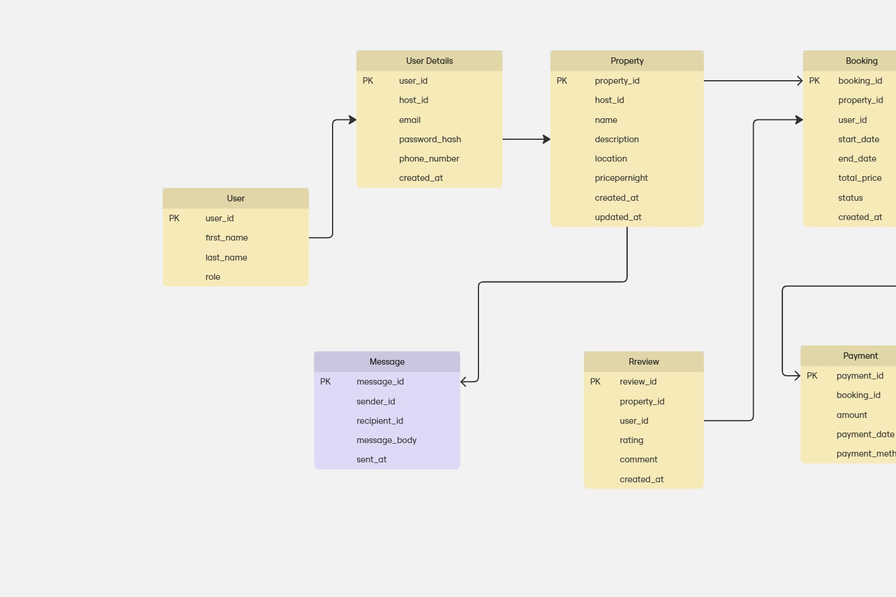

## Normalized ERD

## Changes that were made:
- User table had so many sharable attributes that contained sensitive data
- Relationships could be created with the diversity of unique data
- A separate table containing IDs was created.